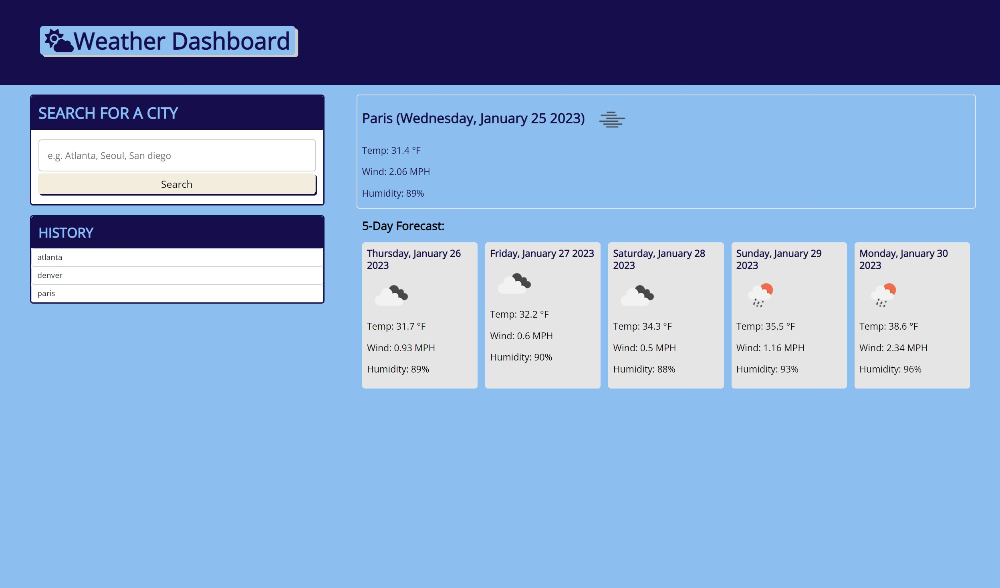

# weatherdashboard-serverside-apis

## Project Description

This project is a weather dashboard that uses apis to allow you to search different cities around the world 
and see the curent and future forcast. The cities searched will be saved in the local storage and also in 
the history section below the search bar. HTML was used to create the content of the project. CSS was used to
style the project. JavaScript is being used to query the apis and complete all functions of the project.

## User Story

**AS A** traveler
**I WANT** to see the weather outlook for multiple cities
**SO THAT** I can plan a trip accordingly

## Acceptance Criteria

**GIVEN** a weather dashboard with form inputs
**WHEN** I search for a city
**THEN** I am presented with current and future conditions for that city and that city is added to the search history
**WHEN** I view current weather conditions for that city
**THEN** I am presented with the city name, the date, an icon representation of weather conditions, the temperature, the humidity, and the wind speed
**WHEN** I view future weather conditions for that city
**THEN** I am presented with a 5-day forecast that displays the date, an icon representation of weather conditions, the temperature, the wind speed, and the humidity
**WHEN** I click on a city in the search history
**THEN** I am again presented with current and future conditions for that city

## Screenshot of Deployed site

## Deployed Link
[Deployed Site] (https://reggiejr44.github.io/weatherdashboard-serverside-apis/)